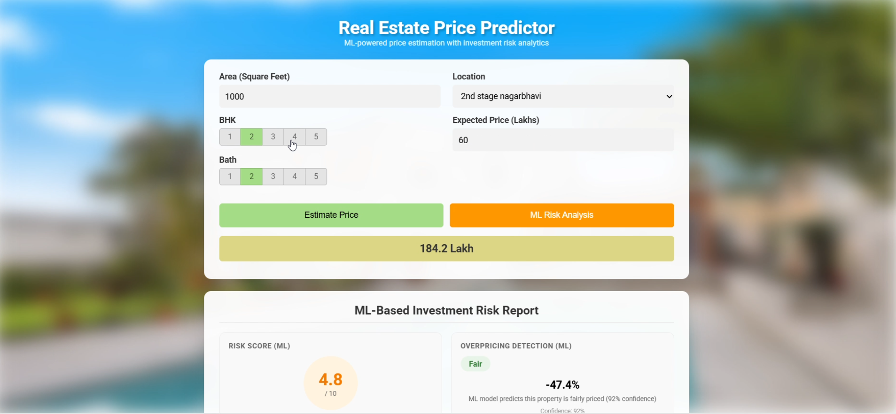
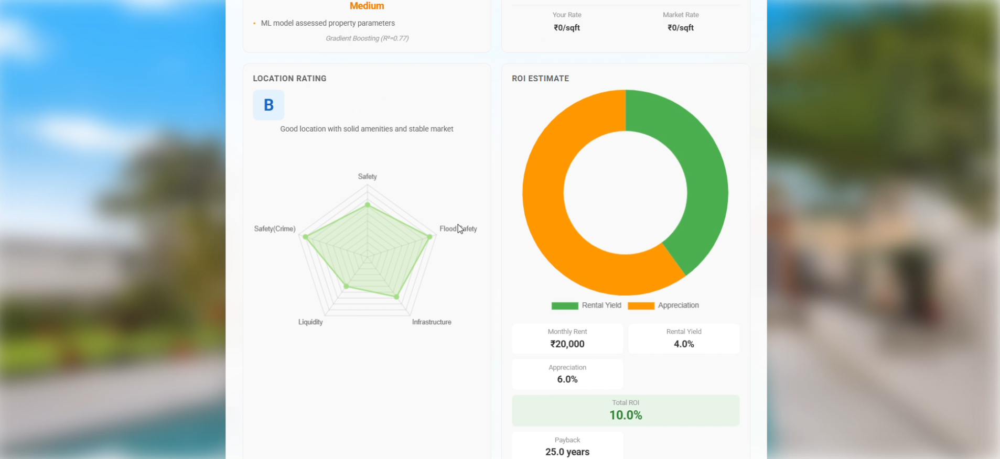
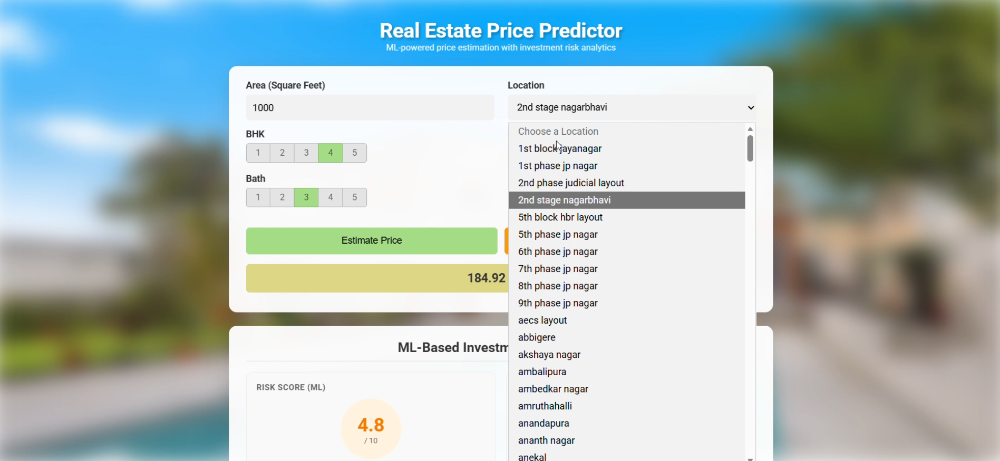
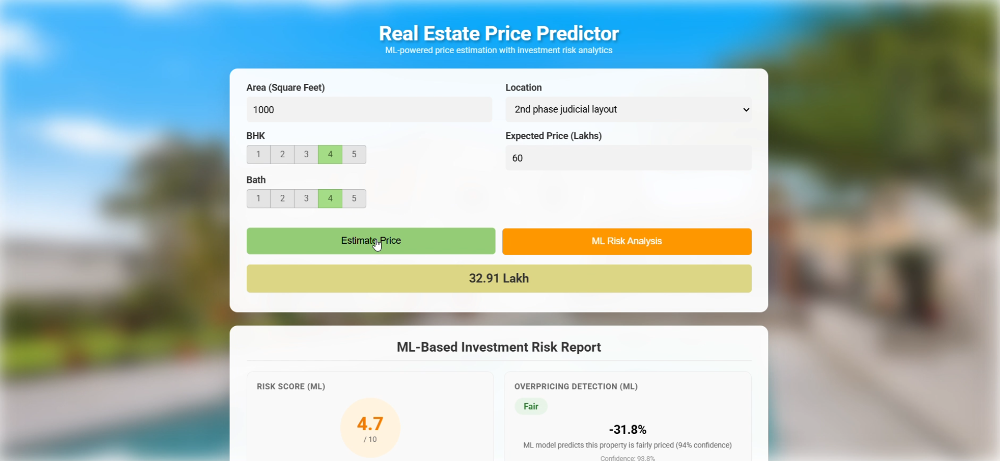

# Bangalore Home Price Predictor

A full-stack machine learning application that predicts residential property prices in Bangalore and provides comprehensive investment risk analysis for home buyers and real estate investors.

---

## What This Project Does

This isn't just a simple price calculator. It combines **ML-based price prediction** with **real-time investment risk assessment** to help buyers make informed decisions before purchasing property in Bangalore.

### Core Features

| Feature | Description |
|---------|-------------|
| **Price Prediction** | ML model estimates fair market price based on area, BHK, bathrooms, and location |
| **Investment Risk Score** | Rates property risk from 1-10 based on multiple factors (overpricing, safety, flood risk, crime, liquidity) |
| **Overpricing Detection** | Compares your expected price against computed market rate and shows % deviation |
| **Location Rating** | Grades locations A-D with breakdowns for safety, infrastructure, flood risk, crime, and liquidity |
| **ROI Estimation** | Calculates monthly rent, rental yield, expected appreciation, total ROI, and payback period |

### Risk Analysis Breakdown

The risk report evaluates properties across 7 dimensions:
- **Price-to-Rent Ratio** - Is the property overpriced relative to rental income?
- **Safety Index** - How safe is the neighborhood?
- **Flood Risk** - Is the area prone to flooding?
- **Infrastructure Score** - Quality of roads, water supply, electricity
- **Market Liquidity** - How easy is it to resell in this area?
- **Crime Rate** - Local crime statistics
- **Space Efficiency** - Carpet area per bedroom ratio

---

## Screenshots









---

## Demo Video

[](https://drive.google.com/file/d/12pGAufd9-9NH9LOzVIzQ3PdseM4OdhXK/view?usp=drive_link)

> [Click here to watch the full demo on Google Drive](https://drive.google.com/file/d/12pGAufd9-9NH9LOzVIzQ3PdseM4OdhXK/view?usp=drive_link)

---

## Tech Stack

| Layer | Technology |
|-------|-----------|
| **Frontend** | HTML5, CSS3, JavaScript (jQuery) |
| **Backend** | Python, Flask |
| **ML Model** | Scikit-learn (Linear Regression / Ridge) |
| **Data Storage** | JSON (columns, location risk data), Pickle (trained model) |

---

## Project Structure

```
Bhp/
├── client/                  # Frontend
│   ├── app.html            # Main UI with form and risk report display
│   ├── app.js              # API calls and dynamic rendering
│   └── app.css             # Styling with responsive design
├── model/                   # Model training
│   ├── banglore_home_prices_final.ipynb   # Jupyter notebook (training pipeline)
│   ├── banglore_home_prices_model.pickle  # Trained ML model
│   └── columns.json        # Feature columns for prediction
├── picture/                 # Screenshots for documentation
│   ├── 1r.png
│   ├── 2r.png
│   ├── 3r.png
│   └── 4r.png
└── server/                  # Backend API
    ├── server.py           # Flask routes (5 API endpoints)
    ├── util.py             # Prediction logic + risk analysis engine
    └── artifacts/          # Runtime artifacts
        ├── banglore_home_prices_model.pickle
        ├── columns.json
        ├── location_risk_data.json    # Location-wise risk/rent/grade data
        ├── investment_model.pickle
        └── overpricing_model.pickle
```

---

## API Endpoints

| Method | Endpoint | Description |
|--------|----------|-------------|
| GET | `/api/get_location_names` | Returns all supported Bangalore locations |
| POST | `/api/predict_home_price` | Predicts price (params: `total_sqft`, `location`, `bhk`, `bath`) |
| POST | `/api/get_risk_report` | Full risk analysis (params: above + `price`) |
| POST | `/api/get_location_risk` | Location-specific risk rating (param: `location`) |

---

## How to Run

**1. Clone the repository**
```bash
git clone https://github.com/Ars062/Price-Predicatioan.git
cd Price-Predicatioan
```

**2. Install dependencies**
```bash
pip install flask numpy scikit-learn
```

**3. Start the Flask server**
```bash
cd Bhp/server
python server.py
```

**4. Open the app**
```
Open Bhp/client/app.html in your browser
```

The server runs on `http://127.0.0.1:5001`

---

## How the ML Model Works

1. **Data**: Bengaluru house price dataset with 13,000+ records
2. **Features**: Location, total square footage, BHK (bedrooms), bathrooms
3. **Preprocessing**: One-hot encoding for locations, outlier removal
4. **Algorithm**: Ridge Regression (regularized linear model)
5. **Output**: Predicted price in Lakhs (INR)

The location risk data is separately compiled with metrics for safety, flood risk, infrastructure, crime, liquidity, rental rates, and appreciation potential across Bangalore neighborhoods.

---

## Use Cases

- **Home Buyers** - Check if a property is fairly priced before making an offer
- **Real Estate Investors** - Evaluate ROI and rental yield for investment decisions
- **Property Consultants** - Quick risk assessment tool for client advisory
- **First-time Buyers** - Understand location quality beyond just the price tag
